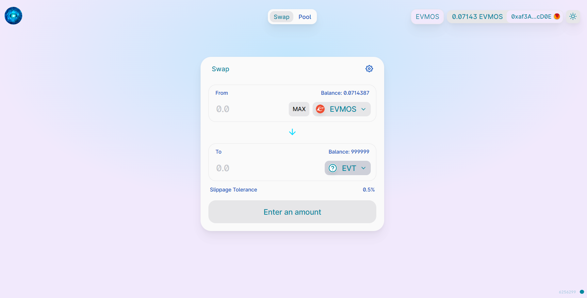
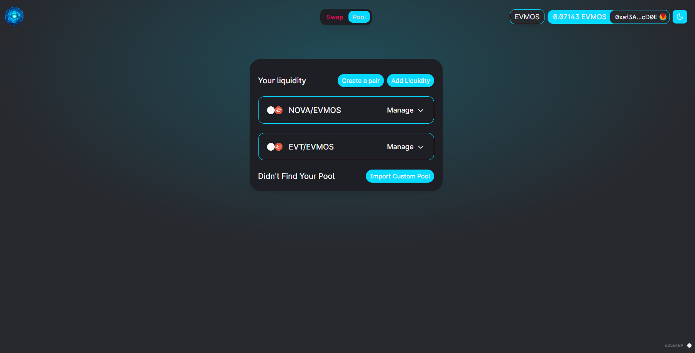

# NovaSwap
A decentralized exchange on EVMOS Chain based on UniswapV2 AMM mechanism

### Swap Page


### Pool Page


## Deployed Contract Addresses

- Factory: 0xe7f7067c9ecab27c5f7f13e02b13ed50931f6d0f
- Router: 0x4cab5791640c439d7aece517d70bfefca4b0fb6b
- Init_Code_hash: 0xd6157cb1c80442a07fe509f707b74004c97caa9b82161a6db465c656c597666e
- WETH Address : 0x3d486E0fBa11f6F929E99a47037A5cd615636E17
- Multicall contract Address : 0x33779291b2588C942E3F179e336663F420cAe8Ba


## Deploying the NovaSwap on local machine

### Clone the repository

After cloning the repository move into the UserInterface Directory

```sh
cd UserInterface
```

install dependencies using **yarn** or **npm**

- **having some dependency version problems in yarn, so advised to use npm commands instead**

```sh
yarn

or

npm install
```
If using Windows then run these two commmands after npm install

```sh
rm -r ./node_modules/@uniswap/sdk

And then this command

cp -r ./forks/@uniswap/sdk ./node_modules/@uniswap/sdk
```

start the development server
```sh
yarn start

or

npm start
```

build with production mode
```sh
yarn build

or

npm run build
```